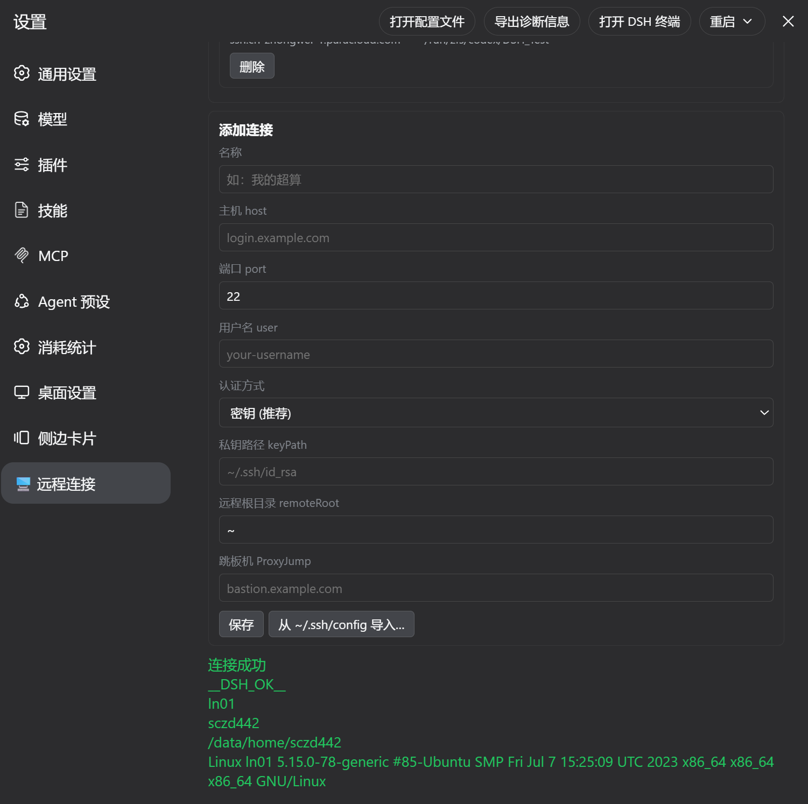
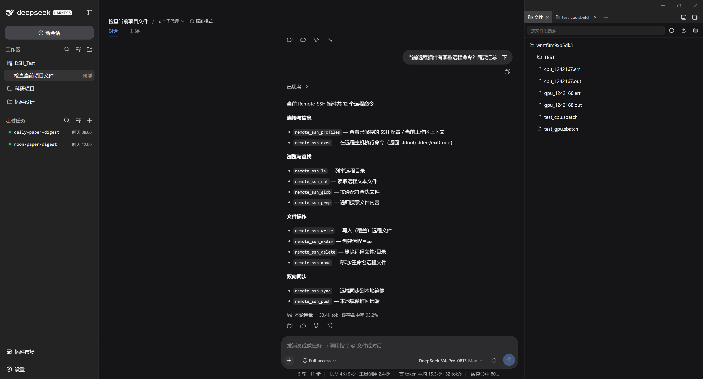
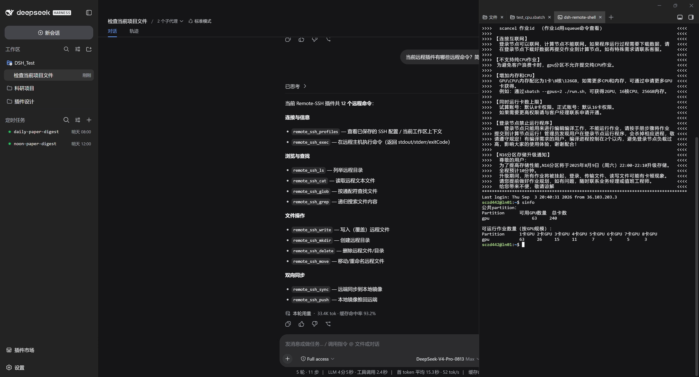

# @zhangfengshun/dsh-remote-ssh

English | [中文](./README.md)

A **DSH** plugin like **VSCode Remote-SSH**: connect to remote HPC / servers via SSH, and directly operate remote files and terminals within DSH's built-in **Files** and **Terminal** sidebar tabs.

## Features

| Feature | Description |
| --- | --- |
| 🔌 SSH Connection | Key / password auth, ProxyJump bastion, one-click import from `~/.ssh/config` |
| 📂 Remote Files | Built-in **Files** tab reads/writes remote files directly via SSH — no sync needed |
| 💻 Remote Terminal | Built-in **Terminal** tab auto-detects remote workspaces, opens SSH interactive shell |
| 🌐 Remote Workspace | Select a remote directory to create a native workspace, one-click enter |
| 🤖 Model Tools | 12 `remote_ssh_*` tools, session-aware with auto-filled connection params |
| ⚡ Faster Opens | Single-roundtrip merged reads + raw text fast path + result cache (LRU + 5s TTL): first open ≈**1.31×**, repeat opens within TTL **0 round-trips**, expired revalidation **≈5×** (measured on a real HPC); `remote_ssh_exec` connection reuse **≈15×** |

## Screenshots

**Settings → 🖥️ Remote SSH**: connection profiles (key / password / ProxyJump bastion) · connection test · one-click import from `~/.ssh/config`

<p align="center"></p>

**Built-in Files tab**: browse the remote host directly (the right-hand tree IS the remote directory, edits save back to remote)

<p align="center"></p>

**Built-in Terminal tab**: auto-SSH to the HPC (SLURM environment shown); the left panel shows the model calling `remote_ssh_*` tools without connection params

<p align="center"></p>

## Installation

```bash
dsh plugin --profile <name> add @zhangfengshun/dsh-remote-ssh@2.3.5
```

> **Restart DSH** after installation. `@zhangfengshun/dsh-remote-ssh` must come **after** `dsh-better-sidebar` in the bundles list.
>
> The built-in **Files** tab SSH interception relies on the file API of **dsh-better-sidebar ≥ 0.15** (`/sidebar/api/fs.*` endpoints) — do not use older versions; verified point-by-point against **dsh-better-sidebar 0.18.0**.

## Usage

1. **Settings → 🖥️ Remote SSH** → Add a connection (host/port/user/key) → Click "Test Connection"
2. **Add Workspace** → Choose "Select Remote Directory…" → Pick a connection → Browse and select
3. Open the built-in **Files** tab → Remote files shown directly, edits save back to remote
4. Open the built-in **Terminal** tab → Auto SSH to remote host (key auth only)

## Model Tools

| Tool | Purpose |
| --- | --- |
| `remote_ssh_profiles` | List saved connections + current session's remote workspace context |
| `remote_ssh_exec` | Execute remote command |
| `remote_ssh_ls` | List remote directory |
| `remote_ssh_cat` | Read remote file |
| `remote_ssh_write` | Write remote file |
| `remote_ssh_grep` | Search remote file contents |
| `remote_ssh_glob` | Find remote files by glob |
| `remote_ssh_mkdir` | Create remote directory |
| `remote_ssh_delete` | Delete remote file/directory |
| `remote_ssh_move` | Move/rename |
| `remote_ssh_sync` | Sync remote to local mirror |
| `remote_ssh_push` | Push local mirror back to remote |

In a remote-workspace session, `profileId` and other connection params can be omitted. All file/command tools run over the persistent SSH session pool + result cache; `remote_ssh_exec` measures ≈15× faster per command.

## How It Works

The plugin registers 4 exact routes (`/sidebar/api/fs.tree`, `fs.read`, `fs.write`, `fs.search`) that intercept better-sidebar's prefix route. When the session cwd contains `.remote-ssh.json`, requests go through SSH; otherwise local fs. The client sees local mirror paths — the Host transparently translates them to remote paths.

Remote reads use a **single-roundtrip merged read**: one pooled command returns the `size/mtime` frame plus the file content (text extensions prefer raw transfer with byte-length + U+FFFD validation and automatic base64 fallback — results are byte-identical), combined with host-side result caching and change invalidation (see below).

A shell wrapper (`~/.dsh/remote-ssh/dsh-remote-shell[.cmd]`) detects the workspace's `.remote-ssh.json` and auto-launches `ssh -tt`, making the built-in **Terminal** tab transparently connect to remote.

## Caching & Consistency

Remote reads and directory listings are cached host-side (read LRU 32 + listing LRU 64 entries, TTL 5s; entries >1MiB are not cached, total budget 32MB so large files never weigh down the host): re-opening or switching back to a tab within the TTL costs **0 network round-trips**; after expiry a lightweight mtime+size revalidation runs first, and unchanged files are served without re-transfer. Writes, deletes, moves, mkdir, uploads, push (syncUp), successful remote exec and mutating git subcommands automatically invalidate the affected cache entries, with a per-profile cache epoch guarding same-second same-size writes and path-space mismatches.

Known limitations:

- Files changed from the integrated terminal (`ssh -tt`) or by other remote processes rely on TTL + revalidation and may be stale for up to **5 seconds**;
- The pooled `/sidebar/file` download path has an effective limit of ≈**6.29MB**; larger files automatically fall back to a one-shot connection download (succeeds, with one extra reconnect);
- Binary content masquerading with a text extension costs one extra base64 fallback round-trip (results are still correct).

## ❤️ Happy Qixi

This project is a Qixi Festival gift for **zhangyi**.

May it connect us as closely as it connects to distant supercomputers. Happy Qixi ❤️

—— August 18, 2026

## License

[MIT](./LICENSE)
